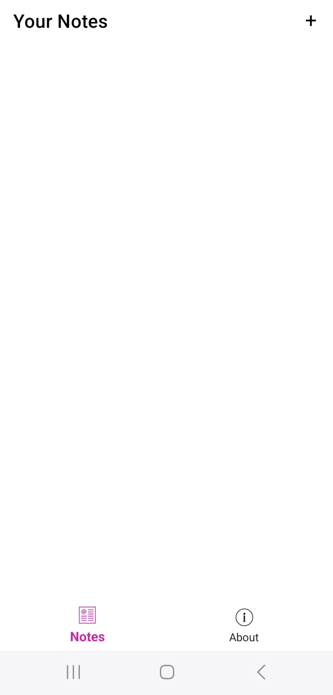
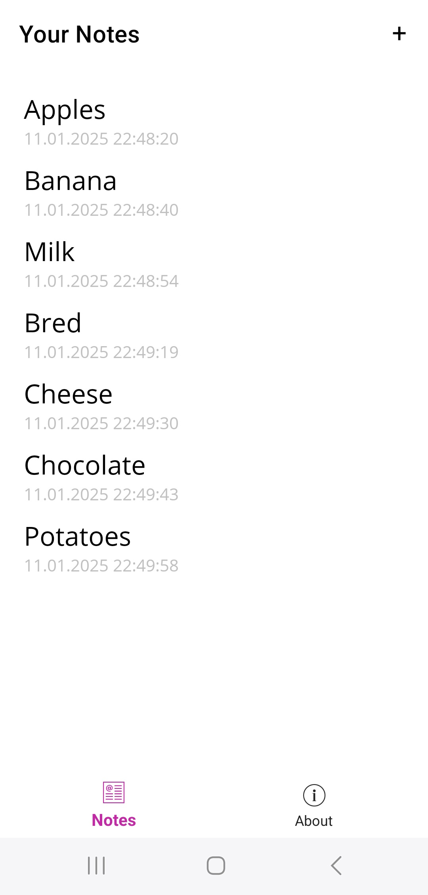
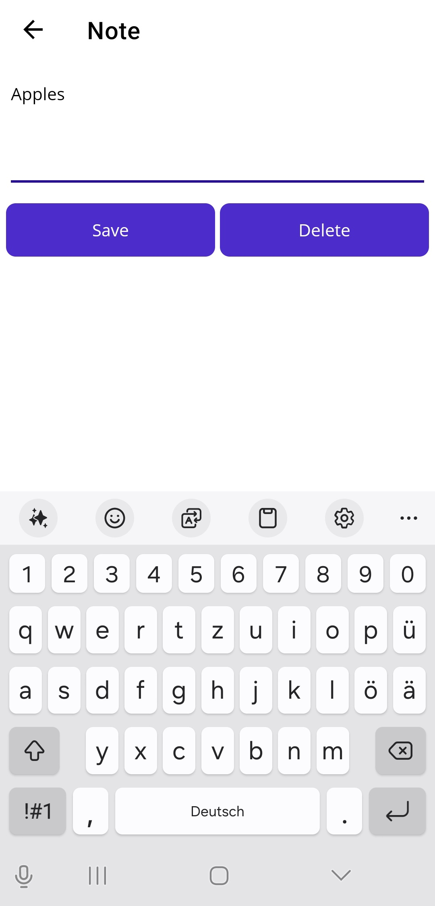
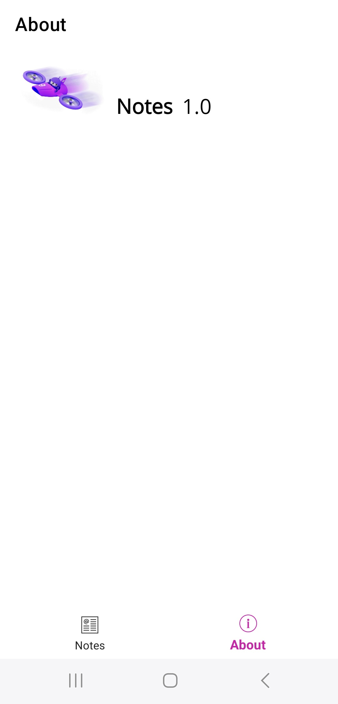

## **Notes**

This is a notes app created with .NET MAUI so it can run on most platforms like Windows, Mac, Android, iPhone and others.

## **Introduction**

This app allows you to add, save and delete notes as basic features and is going to be improved and extended over time. 

## **Local Installation**

To run Notes, follow these steps:

1. Clone the repository: **`git clone https://github.com/baumgarsportfolio/Notes.git`**
2. Navigate to the project directory: **`cd Notes`**
3. Open project in Visual Studio Community Edition 2022
4. Build and run it.

## Screenshots

